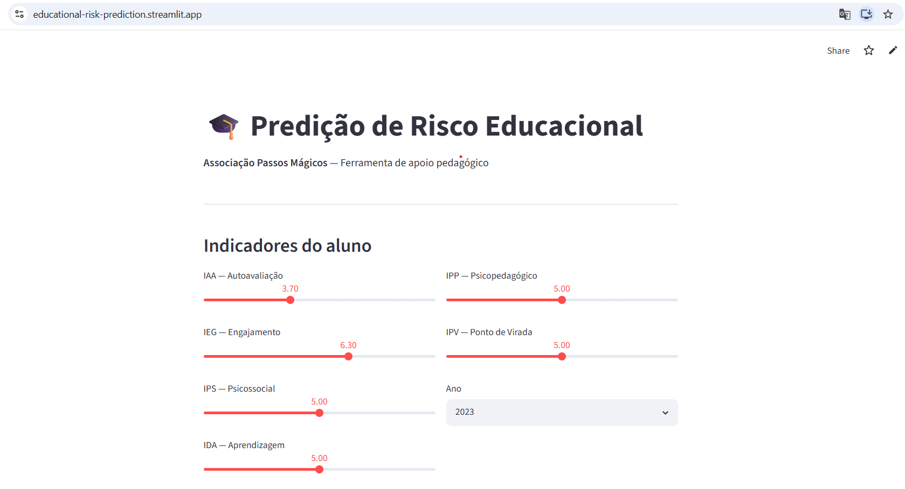
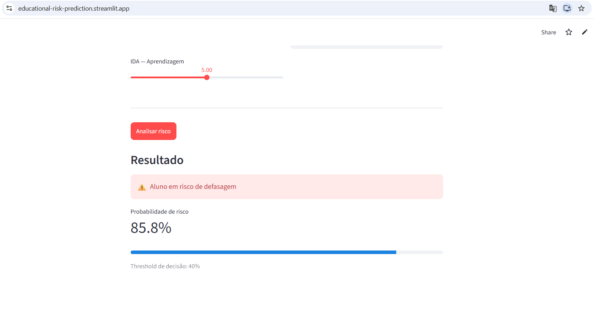

# Educational Risk Prediction — Passos Mágicos

[](https://www.python.org/)
[](https://educational-risk-prediction.streamlit.app)

Predictive model to identify students at risk of educational lag for [Associação Passos Mágicos](https://passosmagicos.org.br/), developed as part of the FIAP POSTECH Datathon — Data Analytics (Phase 5).

## Live Demo

🔗 [educational-risk-prediction.streamlit.app](https://educational-risk-prediction.streamlit.app)




## Problem

Passos Mágicos supports children and youth in social vulnerability in Embu-Guaçu, SP. Using 3 years of assessment data (2022–2024), the goal is to **identify students at risk of educational lag before performance drops consolidate** — enabling proactive intervention by the pedagogical and psychosocial team.

## Dataset

PEDE (Pesquisa Extensiva do Desenvolvimento Educacional) dataset provided by Associação Passos Mágicos. Data is not included in this repository for privacy reasons (LGPD compliance).

| Year | Students | Key variables |
|------|----------|---------------|
| 2022 | 860 | IAN, IDA, IEG, IAA, IPS, IPV, INDE |
| 2023 | 1,014 | + IPP, INDE history |
| 2024 | 1,156 | + active status |

**Unified dataset:** 3,030 records, 1,661 unique students.

## Key Indicators

| Code | Name | Description |
|------|------|-------------|
| INDE | Educational Development Index | Overall weighted score (2.4–9.3) |
| IAN | Level Adequacy | Student is at the correct phase for their age |
| IDA | Learning | Academic performance (Portuguese, Math, English) |
| IEG | Engagement | Participation and activity completion |
| IAA | Self-assessment | Student's perception of themselves |
| IPS | Psychosocial | Socioeconomic and emotional aspects |
| IPP | Psychopedagogical | Psychopedagogical team assessment |
| IPV | Turning Point | Degree of transformation in the cycle |

## Model

- **Algorithm:** XGBoost Classifier
- **Target:** Binary risk of educational lag (`defasagem < 0`)
- **Features:** IAA, IEG, IPS, IDA, IPP, IPV, year
- **Decision threshold:** 0.40 (optimized for recall)
- **ROC-AUC:** 0.648
- **Recall (at-risk class):** 0.89

The threshold was lowered from 0.5 to 0.4 to prioritize recall — in an educational context, missing an at-risk student (false negative) is more costly than a false alarm.

## Project Structure

```
educational-risk-prediction/
├── data/
│   ├── raw/              # Original CSVs (not versioned — LGPD)
│   └── processed/        # Cleaned parquet generated by pipeline
├── docs/images/          # App screenshots
├── notebooks/
│   └── 01_eda.ipynb      # EDA + 11 case questions + predictive model
├── src/
│   └── data/
│       └── prepare.py    # Data cleaning pipeline
├── app/
│   └── streamlit_app.py  # Risk prediction interface
├── models/               # Trained model artifacts
└── requirements.txt
```

## How to Run

```bash
# 1. Clone and create environment
git clone https://github.com/GFurts/educational-risk-prediction
cd educational-risk-prediction
conda create -n passos-magicos python=3.10
conda activate passos-magicos
pip install -r requirements.txt

# 2. Add CSVs to data/raw/
# PEDE2022.csv, PEDE2023.csv, PEDE2024.csv

# 3. Run data pipeline
python src/data/prepare.py

# 4. Run Streamlit app
streamlit run app/streamlit_app.py
```

## Stack

`Python 3.10` · `XGBoost` · `scikit-learn` · `pandas` · `Streamlit` · `joblib` · `matplotlib` · `seaborn`

## Author

**Gabriel Furtado** — [LinkedIn](https://linkedin.com/in/gabriel-furtado30) · [GitHub](https://github.com/GFurts) · [Portfolio](https://gabriel-furtado.vercel.app)

Postgraduate studies in Data Analytics and Machine Learning Engineering (FIAP POSTECH).
